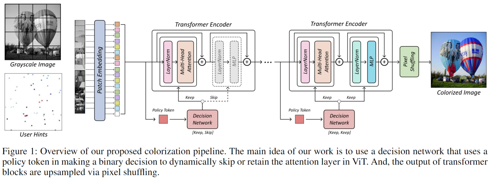
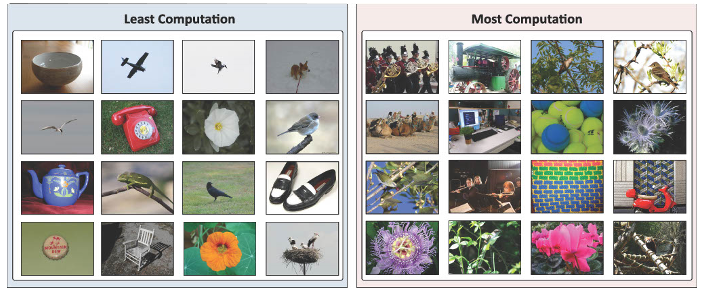

# AAAI'23 Workshop A-ColViT: Real-time Interactive Colorization by Adaptive Vision Transformer

## Abstract
 
Recently, the vision transformer (ViT) has achieved remarkable performance in computer vision tasks and has been actively utilized in colorization. Specifically, for point-interactive image colorization, previous research that uses convolutional layers is limited for colorizing partially an image, which produces inconsistent colors in an image. Thus, vision transformer has been used to alleviate this problem by using multi-head self attention to propagate user hints to distant relevant areas in the image. However, despite the success of vision transformers in colorizing the image and selectively colorizing the regions with user propagation hints, heavy underlying ViT architecture and the large number of required parameters hinder active real-time user interaction for colorization applications. Thus, in this work, we propose a novel efficient ViT architecture for real-time interactive colorization, A-ColViT that adaptively prunes the layers of vision transformer for every input sample. This method flexibly allocates computational resources of input samples, effectively achieving actual acceleration. In addition, we demonstrate through extensive experiments on ImageNet-ctest10k, Oxford 102flower, and CUB-200 datasets that our method outperforms the state-of-the-art approach and achieves actual acceleration.


## Experiments



## Installation

```
conda create -n colorization python=3.9 -y
conda activate colorization
pip install -r requirements.txt
conda install pytorch torchvision torchaudio cudatoolkit=11.3 -c pytorch
```

## Preprocess
```
python preparation/make_mask.py --img_dir /home/data/imagenet/ctest10k/ --hint_dir ./data/ctest10k
```

## Training

```
bash scripts/train_pruned.sh
```


## Inference

```
bash scripts/infer_pruned.sh
```

## Demo
coming soon


## Acknowledgements
* [https://github.com/pmh9960/iColoriT](https://github.com/pmh9960/iColoriT)

* [https://github.com/richzhang/colorization-pytorch](https://github.com/richzhang/colorization-pytorch)
